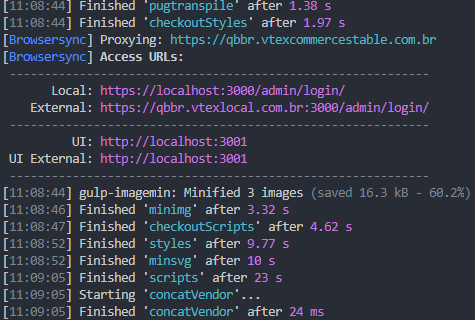

# Sobre
Este projeto tem como fim ajudar novos desenolvedores e designers entenderem como funciona nosso dia a dia, e se integrar aos padrões estabelecidos, é um projeto em constante evolução, e sua contribuição tem muito valor para nossa constante melhoria, para saber mais sobre como contribuir para essa documentação, consulte [Docsify](https://docsify.js.org/).

# Primeiros Passos
1. Abra o terminal e clone o repositório com o comando  
> `git clone https://corebiz-hybear@bitbucket.org/grupoboticario/qdb-ecomm.git`
>
Se quiser pode fazer download através da página oficial do [repositório](https://bitbucket.org/grupoboticario/qdb-ecomm/).  
2. Feito o download, certifique-se de que possui o Node instalado, você pode fazer download por [aqui](https://nodejs.org/en/download/)  
3. Com o Node instalado acesse a pasta do projeto através do terminal e execute o comando:
> `npm i` 
>
Esse comando vai instalar as dependências necessárias para desenvolvimento, talvez demore um pouco

# Inicializando
Após instalado todas as dependências do projeto, é hora de iniciar o projeto, nós utilizamos o Gulp para automatizar diversas tarefas, dentre elas minificar imagens e icones, compilar arquivos, e inicializar o servidor, para começar o projeto basta rodar o comando
> `gulp`
>
Esse comando inicializará a tarefa padrão definida dentro do nosso arquivo *gulpfile.js*
Você deverá ver que após feito isso o console vai apresentar a seguinte mensagem confirmando que o servidor foi ativo e todas as tarefas foram finalizadas como no exemplo abaixo.

